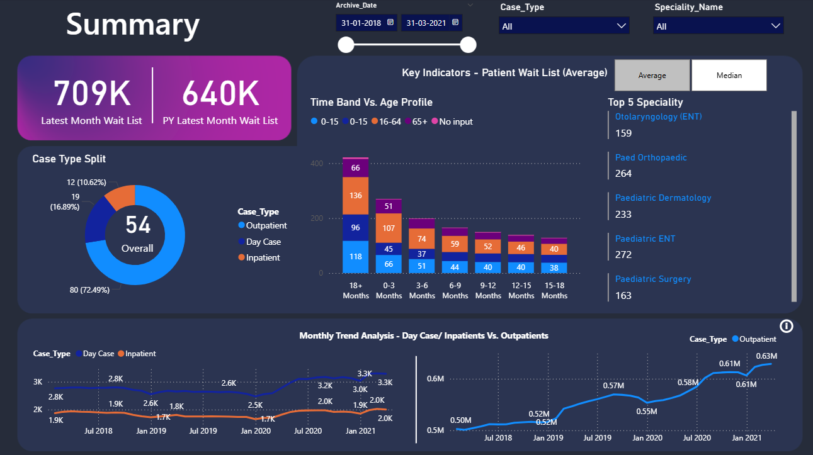
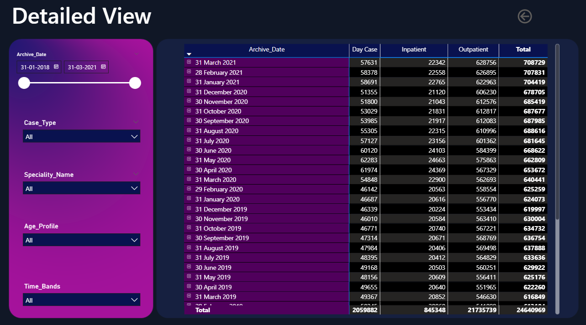
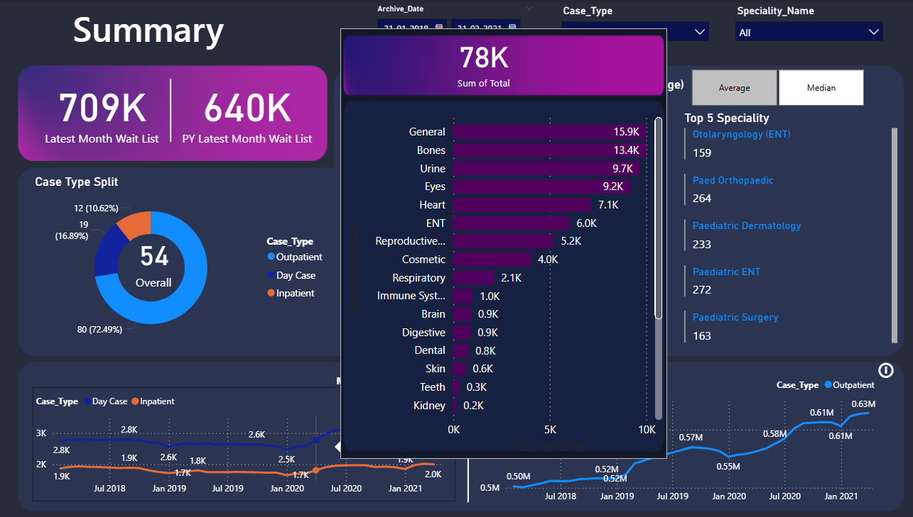

# Healthcare Dashboard – Power BI Project

## 📌 Project Overview
The **Healthcare Dashboard** is an interactive Power BI report designed to provide a comprehensive view of healthcare-related KPIs.  
It offers insights into patient demographics, treatment outcomes, operational efficiency, and resource utilization, enabling data-driven decision-making in the healthcare sector.

## 📂 File Information
- **File Name:** healthcare dashboard.pbix
- **Tool Used:** Microsoft Power BI
- **Data Transformation:** Power Query (ETL process)
- **Visualization:** Power BI Interactive Reports

## 🗂 Data Dictionary (Dataset Schema)
Based on the Power BI data model, the dataset consists of the following key tables, columns, and measures:

### 1. `All_Data` (Main Fact Table)
**Key Columns:**
- `Archive_Date`: Date of the record (includes Year, Quarter, Month, Day hierarchy).
- `Adult_Child`: Categorizes patients as adults or children.
- `Age_Profile`: Detailed age brackets of patients (e.g., 0-15, 16-64, 65+).
- `Case_Type`: Specifies if the patient is Outpatient, Inpatient, or Day Case.
- `Speciality_Name` & `Specialty_HIPE`: The medical department or clinical specialty code.
- `Time_Bands`: Waitlist duration categories (e.g., 0-3 Months, 18+ Months).
- `Total`: The aggregate count of patients.
- `Source.Name`: The origin file or system for the data row.

**DAX Measures:**
- `Latest Month Wait List`: Waitlist total for the most recent month in the data.
- `PY Latest Month Wait List`: Waitlist total for the exact same month in the Previous Year.
- `Average Wait List` & `Median Wait List`: Calculates the respective statistical waitlist size.
- `Avg/Med Wait List`: A dynamic measure that switches between average and median based on the slicer selection.
- `Dynamic Title`: Dynamically updates visual titles based on user interactions.
- `NoDataLeft` & `NoDataRight`: Helper utility measures for formatting visuals.

### 2. `Mapping_Specialty` (Dimension Table)
- `Specialty`: Exact medical specialty name.
- `Specialty Group`: Broader categorization of the specialties (e.g., grouping Paediatrics into a single bucket) for easier high-level analysis.

### 3. `calculation method` (Parameter/Disconnected Table)
- `Calc method`: A helper table used to power the "Average / Median" toggle buttons on the dashboard.

## 🎯 Objectives
1. Analyze patient demographics such as age, gender, and location.
2. Monitor treatment outcomes and operational performance.
3. Improve decision-making through visual analytics.

## 📊 Key Features
- **Patient Demographics:** Distribution by age group, Speciality group/name, Case Type etc.
- **Treatment Analysis:** Recovery rates, ongoing cases, and average treatment duration.
- **Time Trends:** Monthly admissions and discharge patterns.
- **Filters & Slicers:** Interactive filters for gender, location, and time period.
- **KPIs & Cards:** Quick view of key metrics such as total patients, Monthly Wait List,speciality details.

## 🔄 ETL Process
The dashboard was built following the **Extract, Transform, Load (ETL)** methodology:
1. **Extract:** Data imported from healthcare database / CSV files.
2. **Transform:** Data cleaned and processed in Power Query (handling missing values, correcting formats, creating calculated columns).
3. **Load:** Data model created in Power BI with proper relationships.

## 📈 Visuals Used
- **Clustered Bar Chart:** Patient count by TimeBands Vs. Age profile.
- **Pie Chart:** Case Type Split                  
- **Line Chart:** Monthly trends of patient admissions.
- **Table:** Detailed patient records with conditional formatting.
- **Cards:** KPIs for quick reference.

## ⚙️ How to Use the Dashboard
1. Open the `.pbix` file in **Microsoft Power BI Desktop**.
2. Navigate through different report pages.
3. Use slicers to filter by:
   - Time period
   - Case Type
   - Speciality Name
4. Hover over visuals to see detailed tooltips.

## 📌 Insights Gained
- The latest month’s waitlist is 709K, showing an increase compared to the previous year’s 640K.  
- Outpatients form the largest share of cases at 72.49%, followed by day cases at 16.89%, and inpatients at 10.62%.  
- The highest number of patients are in the 18+ months wait band, with significant representation across all age profiles, especially the 16–64 group.  
- The top five specialties with the highest patient counts are:  
  1. Paediatric ENT (272)  
  2. Orthopaedic (264)  
  3. Paediatric Dermatology (233)  
  4. Otolaryngology ENT (159)  
  5. Paediatric Surgery (163)  
- Outpatient numbers have shown steady growth from 0.50M in early 2018 to 0.63M in 2021.  
- Day cases and inpatient counts have fluctuated but remained below 3.3K monthly.  
- The total patient volume reached its peak in March 2021 at 708,729, marking an upward trend in overall waitlist numbers since mid-2020.
- Tooltip breakdown shows General cases lead with 15.9K patients, followed by Bones (13.4K), Urine (9.7K), Eyes (9.2K), and Heart (7.1K).    

## 📊 Dashboard Preview

  
 
-This is an tooltip view 

## Skills Demonstrated
- Power Query: data profiling, basic cleaning, and transformation
- Data Modeling: star-schema design, relationships
- DAX: KPI measures (% split, median/average), ranking, and time intelligence
- Visualization: donut/stacked bar/line charts, KPI cards, and drill-through
- UX Enhancements: dynamic tooltips, slicers, bookmarks, and clear labeling
- Quality & Performance: validation checks, data types, and model optimization

## 🛠 Requirements
- **Power BI Desktop** (latest version recommended)
- Access to healthcare dataset (if reloading data)

## 📜 Author
- Developed by: Sandesh Shrivastava
- Date: *March 2026*
📍 India  
🎓 Aspiring Data Analyst | Excel, Power BI

---

